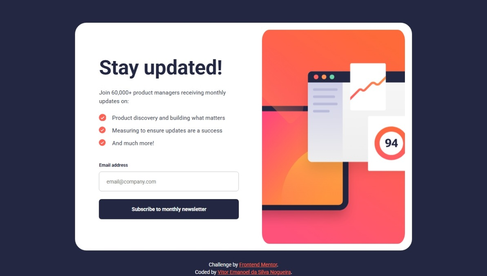

# Frontend Mentor - Newsletter sign-up form with success message solution

This is a solution to the [Newsletter sign-up form with success message challenge on Frontend Mentor](https://www.frontendmentor.io/challenges/newsletter-signup-form-with-success-message-3FC1AZbNrv). Frontend Mentor challenges help you improve your coding skills by building realistic projects. 

## Table of contents

- [Overview](#overview)
  - [The challenge](#the-challenge)
  - [Screenshot](#screenshot)
  - [Links](#links)
- [My process](#my-process)
  - [Built with](#built-with)
  - [What I learned](#what-i-learned)
  - [Continued development](#continued-development)
- [Author](#author)

## Overview

### The challenge

Users should be able to:

- Add their email and submit the form
- See a success message with their email after successfully submitting the form
- See form validation messages if:
  - The field is left empty
  - The email address is not formatted correctly
- View the optimal layout for the interface depending on their device's screen size
- See hover and focus states for all interactive elements on the page

### Screenshot

### Links

- Solution URL: [https://github.com/VitorEmanoelNogueira/newsletter-sign-up-with-success-message-main](https://github.com/VitorEmanoelNogueira/newsletter-sign-up-with-success-message-main)
- Live Site URL: [https://vitoremanoelnogueira.github.io/newsletter-sign-up-with-success-message-main/](https://vitoremanoelnogueira.github.io/newsletter-sign-up-with-success-message-main/)

## My process

### Built with

- Semantic HTML5 markup;
- OOCSS, BEM, SMACSS, namespaces;
- CSS custom properties;
- Flexbox;
- Mobile-first workflow.

### What I learned

- How to handle background-images efficiently with wrappers and aspect ratio;
- The distinction between layout, components, and objects in HTML & CSS architecture;
- How to manage components states more effectively using JS;
- How to write more organized and maintainable RegEx;
- How to make the layout more responsive in big screens with font-size in a simpler way.

### Continued development

- Plan and analyze the project upfront to reduce mental blocks;
- Reapply these lessons in future projects to work more efficiently;
- Deepen understanding of CSS namespaces and class architecture;
- Improve knowledge of JS form validation patterns.

## Author

- Frontend Mentor - [@VitorEmanoelNogueira](https://www.frontendmentor.io/profile/VitorEmanoelNogueira)
